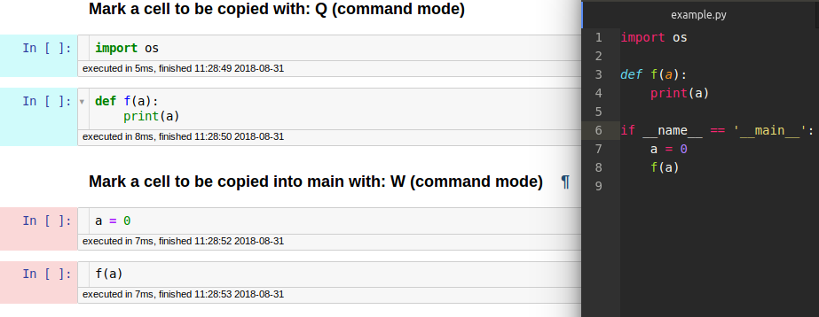

# jupyter-autopy

### Hey there! <br>
__jupyter-autopy__ is a __Jupyter Notebook__ extensions which
allows you to simply copy-paste code cells from an open
`.ipynb` to a `.py` standard python file. <br>
This is similar to `.py` export feature __Jupyter__ has by
default but is more advanced as it allows you to mark the cells
you want to be copied (it also features 2 types of marked cells: _default_ and _main_). 
<br><br>

<br><br>
I created this repo to make my standard workflow _smoother_,
allowing me to use __Notebooks__ in a completely _prototyp-ish_
style without having to worry about ordering / polishing up cells
while being able of importing features working and always updated features from standard `.py` files.
<br>

## Installation

#### Install Prerequisites <br>
https://github.com/ipython-contrib/jupyter_contrib_nbextensions
<br>
https://github.com/Jupyter-contrib/jupyter_nbextensions_configurator <br>
The configurator allows you to modify the proprieties of the extension.

#### Clone and install repo
```
git clone https://github.com/JunkyByte/jupyter-autopy.git
pip install jupyter-autopy
jupyter nbextension install --py jupyter-autopy --user
jupyter nbextension enable --py jupyter-autopy --user
```

You also have to disable xsrf auth otherwise post requests are refused (I didn't manage to add the auth token to the header, if anyone knows how to do it please open an issue)

#### Disable xsrf auth

```
jupyter notebook --generate-config
nano ~/.jupyter/jupyter_notebook_config.py
```
Look for __c.NotebookApp.disable_check_xsrf__ and set it to __True__
```
c.NotebookApp.disable_check_xsrf = True
```


And is done. You can also enable / disable and change colors from the __jupyer_nbextensions_configurator__ window.

------------

[Example notebook (Open it from local with extension installed)](example/example.ipynb)
